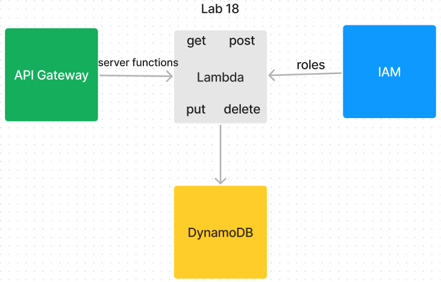

# AWS: Serverless Api

Practice using Amazon AWS for database creation and management.

## Labs 18

### Author: Mike Pace

### Links and Resources

-[Repo](https://github.com/catdude2000/serverless-api)  
-[Root API](https://us-east-2.console.aws.amazon.com/apigateway/home?region=us-east-2#/apis/gcjq7tv0a9/resources/0si0uwxgad)

### Collaborators  

Sara Russert

#### Running the app

clone repo  
`npm i`  in each folder

Routes: handleGetPeople, handlePostPeople, handlePutPeople, handleDeletePeople

Handle get retrieves and displays items in db, represented by id numbers, if using id number in request you can get an individual item, displaying its properties.

Handle post requires an id number in the form of a string, a name, and an age.  Should return a success message with the posted item.

Handle put requires an id number and updates items in the db, returning the updated item.

handle delete requires an id and returns an empty object after deleting an item from the db.

## Overview

Using API Gateway for server functionality, Lambda for functions, IAM for role permissions, and DynamoDB for storage, these files allow you to read,post, update, and delete items from a database.